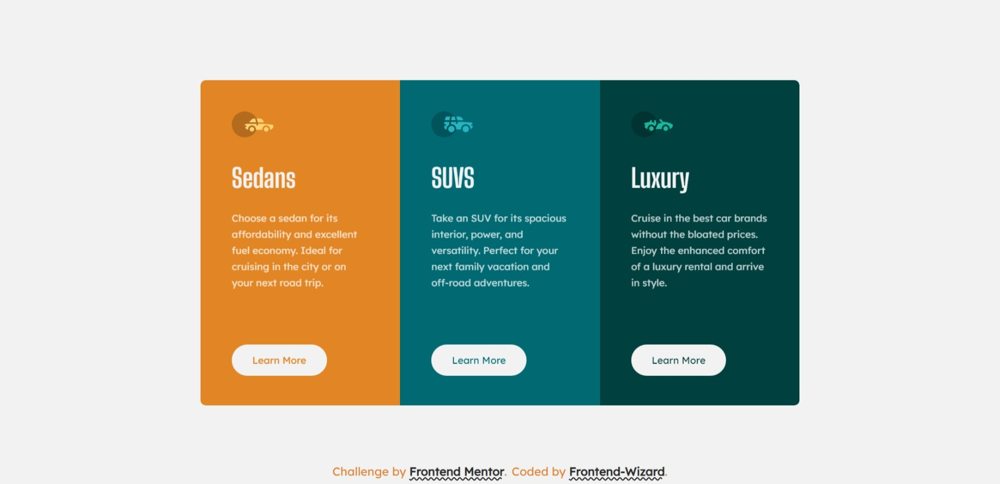

# Frontend Mentor - 3 column preview card 

This is a solution to the 3 column preview card challenge on Frontend Mentor. Frontend Mentor challenges help you improve your coding skills by building realistic projects. 

## Overview

### Screenshot

### Links

- [Solution URL](https://github.com/Frontend-Wizard/3-column-preview-card-component)
- [Live Site URL](https://frontend-wizard.github.io/3-column-preview-card-component)

### Built with

- Semantic HTML5 markup
- CSS animation
- CSS3 custom properties
- JavaScript
- Flexbox
- Grid

## Author

- Website - Ivan / Frontend-Wizard
- Frontend Mentor - [@Frontend-Wizard](https://www.frontendmentor.io/profile/Frontend-Wizard)
